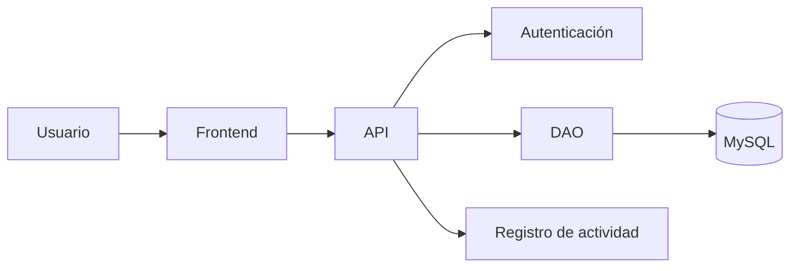

# TaskFlow

> Organiza las tareas de tu equipo de forma sencilla.


## Descripción

TaskFlow es una aplicación para administrar las tareas de un equipo. Su propósito es ayudar a organizar el trabajo y dar seguimiento a las actividades.

## Funcionalidades

- Crear y administrar tareas.
- Consultar el estado de las tareas.
- Organizar las actividades de un equipo.

## Tecnologías utilizadas

- **Lenguajes:** JavaScript, HTML5 y CSS3.
- **Frameworks y librerías:** React y Node.js.
- **Herramientas:** Git y Visual Studio Code.

| Tecnología | Uso |
|---|---|
| JavaScript | Lógica de la aplicación |
| HTML5 | Estructura de las páginas |
| CSS3 | Estilos de la interfaz |
| React | Interfaz de usuario |
| Node.js | Entorno de ejecución |
| Git | Control de versiones |

## Requisitos

Antes de ejecutar el proyecto, asegúrate de tener instalado:

- [Node.js](https://nodejs.org/) versión 16 o superior.
- Git.
- npm o Yarn.

## Checklist de funcionalidades

- [x] Configuración inicial del proyecto.
- [x] Autenticación de usuarios.
- [ ] Integración de la base de datos.
- [ ] Implementación de la interfaz gráfica.
- [ ] Pruebas unitarias.

## Tabla de contenidos

- [Descripción](#descripción)
- [Funcionalidades](#funcionalidades)
- [Tecnologías utilizadas](#tecnologías-utilizadas)
- [Requisitos](#requisitos)
- [Instalación](#instalación)
- [Checklist de funcionalidades](#checklist-de-funcionalidades)

## Instalación

1. Clona el repositorio.
2. Entra en la carpeta del proyecto.
3. Instala las dependencias.
4. Ejecuta la aplicación.

## Uso

1. Inicia sesión o regístrate.
2. Abre la sección de tareas.
3. Crea una tarea e indica su nombre y descripción.
4. Consulta o actualiza el estado de tus tareas.

## Capturas de pantalla

### Pantalla principal


### Inicio de sesión o registro


### Funcionalidad principal: gestión de tareas


### Otra pantalla relevante


## Estructura del proyecto

```text
LAB-GIT-SEM05/
├── docs/
│   └── img/
│       ├── inicio.png
│       ├── sesion.png
│       ├── registro.png
│       └── detalle-tarea.png
├── README.md
└── ...
```

## Arquitectura

El diagrama muestra cómo se relacionan las partes de TaskFlow:



## Contribuidores

- Orellana LLasacce Juan David

## Licencia

Este proyecto se presenta con fines académicos. La licencia está por definir.

